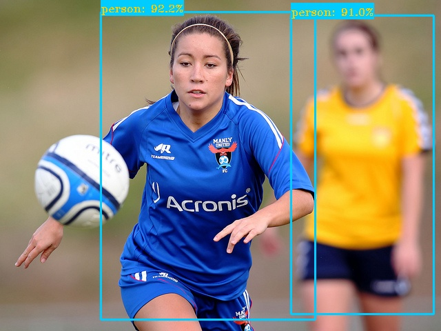

## YOLOv6 训练自己的数据集（包括端到端的TensorRT模型加速）

适用版本：0.1.0 (目前美团并未开源大模型)

最近美团的视觉智能部开源了MT-YOLOv6 (YOLOv6),致力于工业应用。框架同时专注于检测的精度和推理效率，在工业界常用的尺寸模型中：YOLOv6-nano 在 COCO 上精度可达 35.0% AP，在 T4 上推理速度可达 1242 FPS；YOLOv6-s 在 COCO 上精度可达 43.1% AP，在 T4 上推理速度可达 520 FPS。在部署方面，YOLOv6 支持 GPU（TensorRT）、CPU（OPENVINO）、ARM（MNN、TNN、NCNN）等不同平台的部署，极大地简化工程部署时的适配工作。

关于YOLOv6的模型结构介绍可以参考： [【YOLOv6：又快又准的目标检测框架开源啦】](https://mp.weixin.qq.com/s/RrQCP4pTSwpTmSgvly9evg)


下面以YOLOv6s的训练和测试过程为例，详细手摸手基于YOLOv6训练自己的数据集并进行TensorRT模型加速推断！


### 1.训练环境搭建

```
#python 3.8
# pytorch >= 1.8.0
# torchvision >= 0.9.0

pip3 install -r requirements.txt -i https://mirrors.aliyun.com/pypi/simple/
```


### 2.数据准备

研究过YOLOv5的应该知道，YOLOv6支持YOLOv5的数据格式，可以参考<https://github.com/DataXujing/YOLO-v5>

1. 可以使用LabelImg,Labelme,Labelbox, CVAT等来标注数据，对于目标检测而言需要标注bounding box即可。然后需要将标注转换为和darknet format相同的标注形式，每一个图像生成一个`*.txt`的标注文件（如果该图像没有标注目标则不用创建`*.txt`文件）。创建的`*.txt`文件遵循如下规则：

+ 每一行存放一个标注类别
+ 每一行的内容包括class x_center y_center width height
+ Bounding box 的坐标信息是归一化之后的（0-1）
+ class label转化为index时计数是从0开始的

```python
def convert(size, box):
    '''
    将标注的xml文件标注转换为darknet形的坐标
    '''
    dw = 1./(size[0])
    dh = 1./(size[1])
    x = (box[0] + box[1])/2.0 - 1
    y = (box[2] + box[3])/2.0 - 1
    w = box[1] - box[0]
    h = box[3] - box[2]
    x = x*dw
    w = w*dw
    y = y*dh
    h = h*dh
    return (x,y,w,h)
```
每一个标注`*.txt`文件存放在和图像相似的文件目录下，只需要将`/images/*.jpg`替换为`/lables/*.txt`即可（这个在加载数据时代码内部的处理就是这样的，可以自行修改为VOC的数据格式进行加载）

例如：

```
datasets/score/images/train/000000109622.jpg  # image
datasets/score/labels/train/000000109622.txt  # label
```

如果一个标注文件包含5个person类别（person在coco数据集中是排在第一的类别因此index为0）：


<div align=center>

</div>

2. 组织训练集的目录

将训练集train和验证集val的images和labels文件夹按照如下的方式进行存放


<div align=center>

</div>

3. 在`$YOLOv6/data/`下创建`dataset.yaml`(这里我们叫`score.yaml`)

```yaml
train: ./dataset/score/images/train # train images
val: ./dataset/score/images/val # val images
test: ./dataset/score/images/test # test images (optional)

# Classes
nc: 4  # number of classes
names: ['person','cat','dog','horse']  # class names
```
至此数据准备阶段已经完成，过程中我们假设算法工程师的数据清洗和数据集的划分过程已经自行完成

> 注意尽量不要用纯数字作为训练数据的文件名！

### 3.创建模型配置文件

我们可以使用模型配置文件指定模型结构的配置，训练的超参数，优化器，数据增强等；把模型的配置文件放在`$YOLOv6/configs/yolov6s_score.py`

<details>
<summary>点我查看config</summary>

```python
# YOLOv6s model
model = dict(
    type='YOLOv6s',
    pretrained="./weights/yolov6s.pt",
    depth_multiple=0.33,
    width_multiple=0.50,
    backbone=dict(
        type='EfficientRep',
        num_repeats=[1, 6, 12, 18, 6],
        out_channels=[64, 128, 256, 512, 1024],
        ),
    neck=dict(
        type='RepPAN',
        num_repeats=[12, 12, 12, 12],
        out_channels=[256, 128, 128, 256, 256, 512],
        ),
    head=dict(
        type='EffiDeHead',
        in_channels=[128, 256, 512],
        num_layers=3,
        begin_indices=24,
        anchors=1,
        out_indices=[17, 20, 23],
        strides=[8, 16, 32],
        iou_type='siou'
    )
)

solver = dict(
    optim='SGD',
    lr_scheduler='Cosine',
    lr0=0.01,
    lrf=0.01,
    momentum=0.937,
    weight_decay=0.0005,
    warmup_epochs=3.0,
    warmup_momentum=0.8,
    warmup_bias_lr=0.1
)

data_aug = dict(
    hsv_h=0.015,
    hsv_s=0.7,
    hsv_v=0.4,
    degrees=0.0,
    translate=0.1,
    scale=0.5,
    shear=0.0,
    flipud=0.0,
    fliplr=0.5,
    mosaic=1.0,
    mixup=0.0,
)
```

</details>


### 4.模型训练(Train)

+ 单GPU

```shell
python tools/train.py --workers 4 --batch 128 --conf configs/yolov6s_score.py --data data/score.yaml --device 0
```

+ 多GPU

```shell
python -m torch.distributed.launch --nproc_per_node 2 tools/train.py --batch 256 --conf configs/yolov6s_score.py --data data/score.yaml --device 0,1
```

### 5.模型eval和inference

+ Eval

```shell
python tools/eval.py --data data/score.yaml  --weights runs/train/exp/weights/last_ckpt.pt --device 0
```
+ Inference

```shell
python inference.py
#python tools/infer.py --weights output_dir/name/weights/best_ckpt.pt --source img.jpg --device 0
```
<div align=center>

|                                 |                                  |                                  |                                  
| :-----------------------------: | :------------------------------: | :------------------------------: | 
|  |  |  |  

</div>

### 6.TensorRT 模型加速(C++)

我们实现了完全端到端的YOLOv6的tensorRT推断加速，将TensorRT NMS Plugin加入到模型结构实现端到端的推断！

1. 导出ONNX

YOLOv6引入了 [RepVGG](https://arxiv.org/pdf/2101.03697) style 结构，RepVGG Style 结构是一种在训练时具有多分支拓扑，而在实际部署时可以等效融合为单个 `3x3` 卷积的一种可重参数化的结构（融合过程如下图所示）。通过融合成的 `3x3` 卷积结构，可以有效利用计算密集型硬件计算能力（比如 GPU），同时也可获得 GPU/CPU 上已经高度优化的 NVIDIA cuDNN 和 Intel MKL 编译框架的帮助。
实验表明，通过上述策略，YOLOv6 减少了在硬件上的延时，并显著提升了算法的精度，让检测网络更快更强。以 nano 尺寸模型为例，对比 YOLOv5-nano 采用的网络结构，本方法在速度上提升了21%，同时精度提升 3.6% AP。

<div align=center>

</div>

导出ONNX的过程，`layer.switch_to_deploy()`即完成了上述操作

```shell
python deploy/ONNX/export_onnx.py --weights runs/train/exp/weights/last_ckpt.pt  --device 0
```

<div align=center>

</div>

1. 增加NMS Plugin结点


需要在`YOLOv6s.onnx`后拼接下面的结点

<div align=center>

</div>

可执行如下代码：

```shell

python tensorrt/yolov6_add_postprocess.py
python tensorrt/yolov6_add_nms.py

```


2. 序列化Engine

```shell
trtexec --onnx=best_ckpt_1_nms.onnx --saveEngine=yolov6.engine --workspace=3000 --verbose

```

3. 推断测试

+ 前处理的过程

1. OpenCV加载图像
2. letterbox实现
   
    + `r=min(640/image_width, 640/image_height)`:取缩放比最小的边的缩放比例
    + padding

        - `pad_w=(640-image_width*r)/2`;`pad_h=(640-image_height*r)/2`

        - 图像缩放： `interpolation=cv2.INTER_LINEAR`,缩放为`(image_width*r,image_height*r)`
        - 上下填充`pad_h`,左右填充为`pad_w`,填充的像素值为`(114,114,114)`
3. HWC转CHW,BGR转RGB
4. 归一化：逐像素除以255.0

不难发现图像前处理和YOLOv5基本相同。

其C++的实现如下：

```c++
void preprocess(cv::Mat& img, float data[]) {
	int w, h, x, y;
	float r_w = INPUT_W / (img.cols*1.0);
	float r_h = INPUT_H / (img.rows*1.0);
	if (r_h > r_w) {
		w = INPUT_W;
		h = r_w * img.rows;
		x = 0;
		y = (INPUT_H - h) / 2;
	}
	else {
		w = r_h * img.cols;
		h = INPUT_H;
		x = (INPUT_W - w) / 2;
		y = 0;
	}
	cv::Mat re(h, w, CV_8UC3);
	cv::resize(img, re, re.size(), 0, 0, cv::INTER_LINEAR);
	//cudaResize(img, re);
	cv::Mat out(INPUT_H, INPUT_W, CV_8UC3, cv::Scalar(114, 114, 114));
	re.copyTo(out(cv::Rect(x, y, re.cols, re.rows)));

	int i = 0;
	for (int row = 0; row < INPUT_H; ++row) {
		uchar* uc_pixel = out.data + row * out.step;
		for (int col = 0; col < INPUT_W; ++col) {
			data[i] = (float)uc_pixel[2] / 255.0;
			data[i + INPUT_H * INPUT_W] = (float)uc_pixel[1] / 255.0;
			data[i + 2 * INPUT_H * INPUT_W] = (float)uc_pixel[0] / 255.0;
			uc_pixel += 3;
			++i;
		}
	}

}

```


打开`tensorrt/yolov6_trt`下的VS项目，进行推断，其推断结果如下：

<div align=center>

|                                 |                                  |                                  |                                  
| :-----------------------------: | :------------------------------: | :------------------------------: | 
|  |  |  |  

</div>
